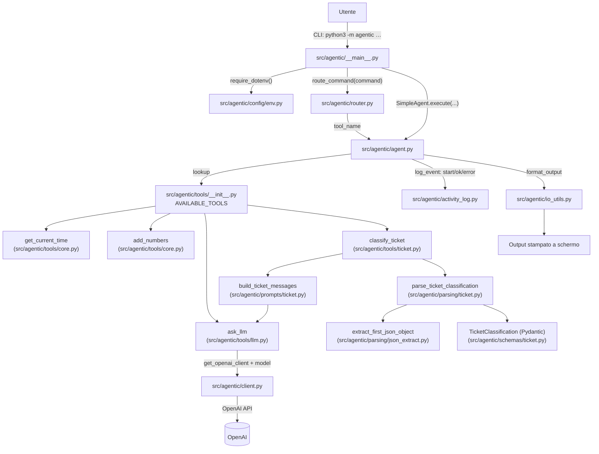

## primo-agente

Mini demo “agentic” in Python: un agente che esegue tool locali e (opzionale) chiama un LLM via riga di comando.

### Quickstart

Requisiti: Python 3.10+ e `pip`.

```bash
python3 -m venv .venv
source .venv/bin/activate
python3 -m pip install -e .
cp .env.example .env
```

### Comandi demo

```bash
python3 -m agentic ora
python3 -m agentic somma 15 30
python3 -m agentic llm "Spiega cos'è un agente in 3 punti"
python3 -m agentic classifica "Non riesco ad accedere al portale"
```

Output atteso (esempio):

```text
[Zeta] Sto pensando al compito: Esegui comando: somma
--- RISULTATO AGENTE ---
45
------------------------
```

Output atteso (esempio `classifica`):

```text
[Zeta] Sto pensando al compito: Esegui comando: classifica
--- RISULTATO AGENTE ---
{
  "category": "Supporto Tecnico",
  "confidence": 0.9,
  "rationale": "Problema di accesso e possibile malfunzionamento del portale."
}
------------------------
```

### Configurazione `.env` (obbligatoria)

```bash
cp .env.example .env
```

Variabili principali:
- `AGENTIC_LOG_PATH`: path del log JSONL (default `logs/agentic.log`)
- `OPENAI_API_KEY`: necessaria per `llm`
- `OPENAI_MODEL`: modello di default per `llm` (es. `gpt-4o-mini`)

Nota:
- `.env` viene caricato all'avvio della CLI (se manca, l'esecuzione fallisce).
- Se non usi `llm`/`classifica`, puoi lasciare `OPENAI_API_KEY` vuota o con un placeholder.
- I secret non vanno mai committati: `.env` è ignorato da git.

### Logging (JSONL)

L'agente salva eventi su file in formato **JSON Lines** (una riga JSON per evento).
È utile per fare debug o per far vedere agli studenti cosa succede “dietro le quinte”.

- Path: controllato da `AGENTIC_LOG_PATH` (default `logs/agentic.log`)
- Formato: una riga per evento, con timestamp `ts`, nome `event` e campi extra
- Redaction: campi sensibili (es. `api_key`, `token`, `secret`, `password`) vengono mascherati nei log

Esempio (una singola riga):

```json
{"ts":"2026-04-29T16:00:00","event":"tool_ok","agent_name":"Zeta","task":"...","tool_name":"add_numbers","elapsed_ms":1}
```

### Perché questo repo è “professionale” (i 4 requisiti)

- **Architettura modulare**: responsabilità separate per area
  - Tool: `src/agentic/tools/` + registry in `src/agentic/tools/__init__.py`
  - Prompts: `src/agentic/prompts/`
  - Parsing: `src/agentic/parsing/`
  - Schemi Pydantic: `src/agentic/schemas/`
  - Config: `src/agentic/config/`
- **Gestione sicura dei secret**:
  - `.env` è **obbligatorio** e viene caricato da `require_dotenv()` in `src/agentic/config/env.py`
  - i log applicano **redaction** di campi sensibili in `src/agentic/activity_log.py`
- **Output strutturato validato da Pydantic**:
  - l'agente produce sempre un `ToolResult` (`src/agentic/schemas/result.py`) e poi lo renderizza per la CLI (`src/agentic/io_utils.py`)
- **Few-shot prompting operativo**:
  - prompt versionato con `PROMPT_ID` in `src/agentic/prompts/ticket.py`
  - parsing robusto + validazione schema in `src/agentic/parsing/ticket.py` e `src/agentic/schemas/ticket.py`
  - fixtures + test di regressione in `tests/fixtures/` e `tests/test_logic.py`

### Architettura (diagramma)



### Test

```bash
python3 -m venv .venv
source .venv/bin/activate
python3 -m pip install -e ".[test]"
python3 -m pytest
```

### Dove mettere le mani

- `src/agentic/__main__.py`: CLI (`python3 -m agentic ...`)
- `src/agentic/config/env.py`: caricamento `.env` (obbligatorio per la CLI)
- `src/agentic/router.py`: mapping comando → tool
- `src/agentic/tools/`: implementazione tool (modulare)
- `src/agentic/tools/__init__.py`: registro tool (`AVAILABLE_TOOLS`)
- `src/agentic/agent.py`: `SimpleAgent`
- `src/agentic/activity_log.py`: logging JSONL (+ redaction dei campi sensibili)
- `src/agentic/io_utils.py`: rendering “pretty” dell'output in CLI
- `src/agentic/prompts/`, `src/agentic/parsing/`, `src/agentic/schemas/`: pipeline few-shot + parsing + validazione (es. ticket)
- `src/agentic/logic.py`: compat layer per import storici (lezioni/tutorial)

### Come aggiungere un nuovo comando/tool (mini guida)

- Aggiungi una funzione in `src/agentic/tools/` (un “tool” è una normale `def`)
- Registrala in `src/agentic/tools/__init__.py` dentro `AVAILABLE_TOOLS`
- Aggiungi il mapping in `src/agentic/router.py` dentro `COMMAND_TO_TOOL`
- (Opzionale) Estendi la CLI in `src/agentic/__main__.py` se il comando richiede argomenti
